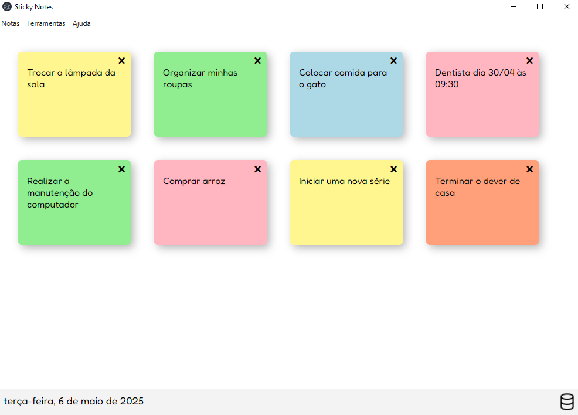

# stickynotes
Projeto de notas autoadesivas (estilo post-it) usando o framework Electron e o banco de dados MongoDB

## Autor
Claudio Silva

## Pré-requisitos de instalação:
- Windows 10 ou superior
- Possuir o banco de dados MongoDB

### Instalação do MongoDB
[MongoDB](https://www.mongodb.com/try/download/community)

Baixe o MongoDB Community Server e instale com a opção "Install MongoDB as a Service" ativada.

Após instalar, ele inicia automaticamente.

### Instalação do Stickynotes
Em releases, faça o download da última versão (.exe) disponibilizada.
